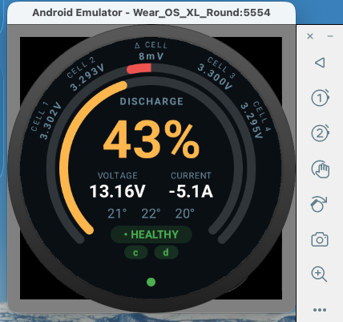
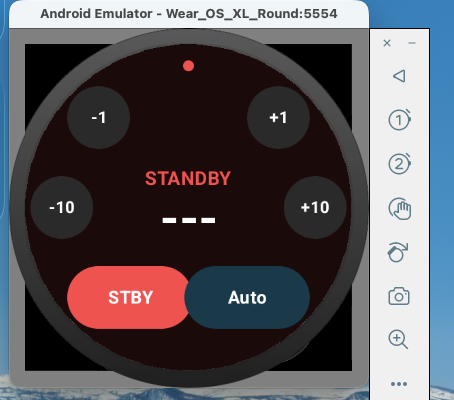
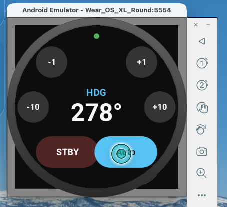
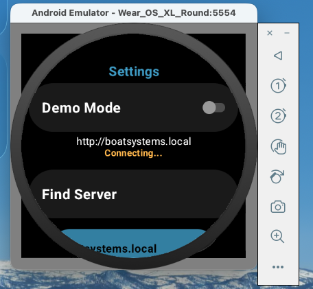

# BoatWatch


WearOS apps for a Galaxy Watch 6 Classic (WearOS 5.0) that communicate over WiFi with custom ESP32 firmware ([N2KNMEA0183Wifi](https://github.com/ieb/N2KNMEA0183Wifi)).

## Why ?

Over the years I have built a number of hand held controls for use on a boat while sailing. Generally they have been clunky and substandard, not very pleasant to use. No surprise since I am 1 engineer with limited resources and not running a multi million $ R&D organization manufacturing millions of units. So this is an alternative approach, using a wearOS watch in my case a cheap second hand Galaxy Watch 6 classic which is reasonably waterproof, has OK battery life and connectivity as the hardware platform for some very simple but useful apps. Previously I used a web based app on my phone for battery monitoring which was a pain, and a Raymarine remote on a lanyard for the autopilot control. If a watch works at sea for real remains to be seen. Could be a disaster.

## The Apps

Two standalone apps:

- **Battery Monitor** — displays voltage, current, SOC, cell voltages, and temperatures from a 4-cell LiFePO4 pack via JBD BMS



- **Autopilot Control** — controls a Raymarine autopilot (mode switching, heading/wind adjustments) via NMEA 2000 commands




- **Settings** - both apps allow the server to be found and selected




## Prerequisites

- JDK 17 (`brew install openjdk@17` on macOS or  [Adoptium](https://adoptium.net/en-GB/temurin/releases?version=17) if you want to avoid a full XCode install)
- Android SDK with API 34
- [uv](https://docs.astral.sh/uv/) for the mock firmware server. [install](https://docs.astral.sh/uv/getting-started/installation/)
- A WearOS emulator or Galaxy Watch 6 Classic for real, now relatively cheap off ebay

## Android SDK Setup (Command Line)

Android Studio installs the SDK at `~/Library/Android/sdk` but does not include `adb` or `sdkmanager` on your PATH by default.

### 1. Add tools to your shell profile

Add the following to `~/.zshrc` (or `~/.bashrc`):

```bash
export ANDROID_HOME="$HOME/Library/Android/sdk"
export PATH="$ANDROID_HOME/platform-tools:$ANDROID_HOME/emulator:$PATH"

# Only needed if you installed command-line tools (see step 2):
export PATH="$ANDROID_HOME/cmdline-tools/latest/bin:$PATH"
```

Then reload:

```bash
source ~/.zshrc
```

`platform-tools` contains `adb`. Verify with:

```bash
adb version
```

### 2. Install command-line tools (optional, for sdkmanager)

Android Studio does not ship `sdkmanager` by default. To get it:

**Option A — via Android Studio:**
Open Android Studio > Settings > Languages & Frameworks > Android SDK > SDK Tools tab > check **Android SDK Command-line Tools (latest)** > Apply.

**Option B — standalone download:**

```bash
# Download and extract into the SDK directory
cd ~/Library/Android/sdk
mkdir -p cmdline-tools
cd cmdline-tools
curl -O https://dl.google.com/android/repository/commandlinetools-mac-11076708_latest.zip
unzip commandlinetools-mac-*.zip
mv cmdline-tools latest
rm commandlinetools-mac-*.zip
```

Then you can use `sdkmanager`:

```bash
sdkmanager "platforms;android-34" "build-tools;34.0.0" "platform-tools"
```

For running a WearOS emulator:

```bash
sdkmanager "system-images;android-34;google_apis;arm64-v8a" "emulator"
```

### 3. local.properties

The project expects the Android SDK at `~/Library/Android/sdk`. If yours is elsewhere, edit `local.properties`:

```properties
sdk.dir=/path/to/your/android/sdk
```

## Project Structure

```
BoatWatch/
  battery/          WearOS app — Battery Monitor
  autopilot/        WearOS app — Autopilot Control
  mock-firmware/    Python HTTP server simulating ESP32 firmware
  spec.md           Requirements specification
```

## Building

Build both apps:

```bash
./gradlew assembleDebug
```

Build a single app:

```bash
./gradlew :battery:assembleDebug
./gradlew :autopilot:assembleDebug
```

Release builds (minified):

```bash
./gradlew assembleRelease
```

APK outputs are in `battery/build/outputs/apk/` and `autopilot/build/outputs/apk/`.

## Development with Mock Firmware

The mock firmware server simulates the ESP32 HTTP API so you can develop and test without real hardware.

### Start the mock server

```bash
cd mock-firmware
uv run mock_firmware.py
```

This starts on `http://0.0.0.0:8080` by default. Options:

```bash
uv run mock_firmware.py --port 9090 --host 127.0.0.1
```

### What it simulates

| Endpoint | Method | Purpose |
|----------|--------|---------|
| `/api/store` | GET | Battery data (B-line CSV), polled every 5s by battery app |
| `/api/seasmart?pgns=...` | GET | Streaming autopilot status (SeaSmart/PCDIN sentences) |
| `/api/seasmart` | POST | Receive autopilot commands (mode change, heading adjust) |

The mock server simulates:
- A 4-cell LiFePO4 battery slowly discharging with cell voltage jitter
- An autopilot with drifting heading that responds to mode and heading commands
- Periodic error flags for testing error display

### Quick test with curl

```bash
# Battery data
curl http://localhost:8080/api/store

# Stream autopilot status
curl -N "http://localhost:8080/api/seasmart?pgns=65379,65359,65360,65345"
```

## Testing on Emulator

### 1. Create a WearOS emulator

In Android Studio: **Tools > Device Manager > Create Device** and select a Wear OS device (round, API 34).

```bash
emulator -list-avds
emulator -avd Wear_OS_XL_Round
```

### 2. Build debug APKs

Debug builds use fake data sources that don't need the mock server — they generate simulated data internally.

```bash
./gradlew assembleDebug
```

### 3. Install on emulator

```bash
adb install battery/build/outputs/apk/debug/battery-debug.apk
adb install autopilot/build/outputs/apk/debug/autopilot-debug.apk
```

The apps appear as "Battery" and "Autopilot" in the watch launcher.

### Debug vs Release data sources

| Build | Battery app | Autopilot app |
|-------|-------------|---------------|
| Debug | `FakeBatteryDataSource` (no network) | `FakeAutopilotClient` (no network) |
| Release | `HttpBatteryDataSource` (polls firmware) | `HttpAutopilotClient` (streams from firmware) |

To test with the mock server instead of fake data, change `FAKE_DATA`/`FAKE_HTTP` to `false` in the debug build type in the module's `build.gradle.kts`, then point the app's settings screen to `http://<host-ip>:8080`.

## Testing on a Real Watch

### 1. Enable Developer Options on the watch

**Settings > About watch > Software > tap Build number 7 times**

### 2. Enable ADB debugging

**Settings > Developer options > ADB debugging > ON**

**Settings > Developer options > Wireless debugging > ON**, 

### 3. Pair

**Settings > Developer options > Wireless debugging > Pair

A PIN will be displayed with a IP and port

```bash
adb pair <watch-ip>:<port>
Enter pairing code: <pin>

adb devices -l
```

Note the name of the device as paired

### 4. Install release APKs

```bash
./gradlew assembleRelease
adb -s <device-name _adb-tls-connect._tcp > install battery/build/outputs/apk/release/battery-release.apk
adb -s <device-name _adb-tls-connect._tcp > install autopilot/build/outputs/apk/release/autopilot-release.apk
```

### 5. Configure server URL

Both apps default to `http://boatsystems.local`. To change this, open the settings screen (swipe right on the main screen) and update the URL.

If mDNS doesn't resolve on the watch, use a direct IP address instead (e.g., `http://192.168.1.100`).

## Deploying to the Boat

### Network setup

The watch connects to the boat's WiFi network. The ESP32 firmware serves the HTTP API on port 80 by default.

1. Connect the Galaxy Watch to the boat WiFi
2. Ensure the watch can reach the ESP32 (ping test or just launch the app)
3. The default URL `http://boatsystems.local` should resolve via mDNS if the firmware is configured with that hostname

### Firmware requirements

The ESP32 firmware ([N2KNMEA0183Wifi](https://github.com/ieb/N2KNMEA0183Wifi)) must:

- **Battery app:** Expose a `B,` line in the `/api/store` response with BMS register data. This requires adding an `output()` method to the `JdbBMS` class (see `lib/jdbbms/jdb_bms.cpp`).
- **Autopilot app:** Allow PGN 126208 in the `n2k.apifilter` configuration so the watch can send commands to the N2K bus.

## Architecture

### Battery Monitor

```
MainActivity
  └─ WatchApp (Compose navigation)
       ├─ BatteryScreen — main display (SOC, voltage, cells, temps)
       └─ SettingsScreen — server URL

BatteryViewModel
  └─ BatteryDataSource (interface)
       ├─ FakeBatteryDataSource  (debug: simulated data)
       └─ HttpBatteryDataSource  (release: polls GET /api/store)
              └─ StoreApiParser   (parses CSV B-line)
```

### Autopilot Control

```
MainActivity
  └─ WatchApp (Compose navigation)
       ├─ MainScreen — radial button layout (±1, ±10, STBY, Auto, bezel)
       └─ SettingsScreen — server URL

AutopilotViewModel
  └─ AutopilotHttpClient (interface)
       ├─ FakeAutopilotClient  (debug: simulated autopilot)
       └─ HttpAutopilotClient  (release: streaming GET + POST)

Protocol layer:
  SeaSmartCodec    — encode/decode $PCDIN sentences
  RaymarineN2K     — build PGN 126208 command byte sequences
  RaymarineState   — parse PGN 65379/65359/65360/65345 status
```

### Communication Protocol

The apps talk to the firmware over HTTP using two formats:

- **Battery:** CSV over `GET /api/store` (polled every 5s)
- **Autopilot:** SeaSmart ($PCDIN) sentences over `GET /api/seasmart` (streaming) and `POST /api/seasmart` (commands)

Autopilot commands use NMEA 2000 PGN 126208 (Command Group Function) targeting Raymarine proprietary PGNs. Heading and wind angles are encoded as radians × 10000, uint16 little-endian.
